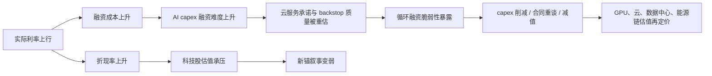

## Executive Call

这个框架监控的是一个核心问题：AI 算力、云资本开支和大型科技股现金流，是否正在成为风险资产的新“信用锚”；以及这个新锚是在被真实应用收入验证，还是正在被循环融资和估值扩张放大。

当前版本是框架稿，未接入实时数据。数据新鲜度：截至 2026-07-09，仅使用 vault 内部来源 央行印钱 与已有 AI 基建研究，不含实时市场数据。

## 核心判据

### 脆弱性累积情景

当以下四个条件同时出现，要重点检查 AI Circular Financing 是否在积累脆弱性：

- 实际利率上行。
- 黄金走弱。
- 科技股估值承压。
- AI capex 仍激进扩张。

这组信号的含义是：折现率和融资成本开始变贵，传统避险资产没有提供有效缓冲，科技股估值锚变弱，但 AI 基建仍在消耗大量资本。此时最危险的不是“AI 没需求”，而是“需求兑现速度低于融资链条扩张速度”。

### 新锚延续情景

当以下三个条件同时出现，风险资产的“新锚”叙事更容易延续：

- 实际利率下行。
- 金融条件转松。
- AI 应用收入兑现。

这组信号的含义是：折现率压力缓解，融资可得性改善，而 AI 资本开支背后开始出现外部客户收入和现金流验证。此时 AI capex 更像成长投资，而不是纯粹融资循环。

## 监控仪表盘

| 模块 | 指标 | 数据源 | 频率 | 风险方向 |
|---|---|---|---|---|
| 实际利率 | 10Y TIPS real yield `DFII10` | FRED | 日频 | 上行 = 压估值、压黄金、压长久期资产 |
| 通胀预期 | 10Y breakeven `T10YIE` | FRED | 日频 | 下行且实际利率上行 = 流动性收缩压力 |
| 名义利率 | 10Y Treasury `DGS10` | FRED | 日频 | 快速上行 = 折现率和融资成本压力 |
| 金融条件 | Chicago Fed NFCI `NFCI` | FRED | 周频 | 上行 = 金融条件收紧 |
| 流动性 | Fed balance sheet `WALCL` | FRED | 周频 | 收缩 = 系统流动性压力 |
| 货币量 | M2 `M2SL` | FRED | 月频 | 增速下行 = 信用扩张降温 |
| 信用风险 | HY OAS `BAMLH0A0HYM2` | FRED | 日频 | 扩张 = 融资链条压力 |
| 投资级信用 | IG OAS `BAMLC0A0CM` | FRED | 日频 | 扩张 = 大型企业融资压力 |
| 黄金 | Gold spot / futures | FMP / market data | 日频 | 实际利率上行时走弱 = 传统锚失效 |
| 科技估值 | Mega-cap tech forward P/E, EV/FCF | FMP / estimates | 周频 | 多重收缩 = 新锚承压 |
| AI capex | MSFT/AMZN/GOOGL/META/ORCL/NVDA capex | Filings / FMP | 季频 | capex 继续上修但收入未兑现 = 脆弱性上升 |
| AI 收入验证 | Cloud AI revenue, RPO, AI ARR proxies | Filings / transcripts | 季频 | 收入兑现 = 新锚更稳 |
| 循环融资 | Strategic investments, cloud commitments, backstops | Filings / news / contracts | 事件驱动 | 投资与收入闭环增强 = 质量折价 |
| GPU 利用率 | Rental pricing, utilization, delivered MW | 专题数据 | 月/季频 | 价格或利用率下行 = capex 需求风险 |

## 四象限状态机

| 状态 | 宏观条件 | AI 基本面 | 判断 | 姿态 |
|---|---|---|---|---|
| A. Goldilocks 新锚延续 | 实际利率下行，金融条件转松 | AI 应用收入兑现，capex 有订单支撑 | 成长锚有效 | `watchlist / press winners after proof` |
| B. 融资驱动繁荣 | 实际利率稳定或小幅上行 | capex 激进，但收入验证不足 | 估值可能继续，但质量下降 | `wait for proof / hedge duration` |
| C. 脆弱性累积 | 实际利率上行，黄金走弱，信用利差扩张 | capex 不降反升，循环融资增加 | 风险资产新锚变脆 | `re-underwrite / trim crowded expressions` |
| D. 去杠杆破裂 | 金融条件收紧，信用利差跳升 | capex 削减、合同重谈、减值 | 循环融资反噬 | `exit weak links / hold only cash-flow winners` |

## 风险打分

每个模块给 0-2 分：

- `0`：支持新锚延续。
- `1`：中性或信号混杂。
- `2`：显示脆弱性上升。

| 分数 | 状态 | 解读 |
|---|---|---|
| 0-5 | Green | 新锚叙事仍有宏观和基本面支撑 |
| 6-10 | Yellow | 叙事可延续，但需要等待收入和利用率证明 |
| 11-16 | Orange | 脆弱性累积，重点检查循环融资和客户质量 |
| 17+ | Red | 去杠杆风险上升，估值和盈利预期可能双杀 |

## 传导链

## 循环融资检查清单

当状态进入 Orange 或 Red，逐项检查：

- AI 客户收入是否来自外部终端客户，而不是来自战略投资资金回流。
- 云服务收入是否与同一客户的股权投资、预付款、融资支持绑定。
- 数据中心 capex 是否有足够 signed offtake，且 delivered MW 能按期转化为收入。
- GPU 租赁价格和利用率是否支撑债务服务。
- 供应商是否通过 backstop、revenue share、vendor financing 或采购承诺隐性支持客户。
- 客户集中度是否上升，RPO 是否越来越依赖少数 AI lab。
- capex 上修是否伴随 FCF 下修、折旧压力上升或债务增加。

## 上市股票映射

| 暴露层 | 代表公司 | 第一影响变量 | 风险点 |
|---|---|---|---|
| GPU / 加速器 | Nvidia, AMD | 数据中心收入、订单、客户质量 | 循环融资放大需求，后续订单降速 |
| 云与 AI 平台 | Microsoft, Amazon, Google, Oracle, Meta | capex、云收入、RPO、FCF | capex 超前于收入，折旧和电力成本压 FCF |
| AI Lab | OpenAI, Anthropic | ARR、算力租赁、融资能力 | 收入兑现低于云承诺 |
| 数据中心 | CoreWeave, Neocloud | 利用率、租赁价格、债务成本 | GPU 残值和 DSCR 被重估 |
| 半导体链 | TSMC, Broadcom, Micron Technology | AI 订单、HBM、网络互联 | AI 订单集中和库存周期 |
| 能源与电网 | NextEra Energy, Fluence Energy, Enphase Energy | 数据中心电力需求、储能订单 | 主题需求无法转化为项目收益 |

## 触发动作

| 触发 | 动作 |
|---|---|
| 实际利率上行 + 科技股估值收缩 + HY/IG spread 扩张 | 把 AI 链条从成长研究切换到融资质量研究 |
| AI capex 继续上修，但云收入/RPO/AI ARR 未同步上修 | 降低对上游订单可持续性的信心 |
| GPU 租赁价格或利用率下行，同时债务融资继续扩张 | 优先检查 Neocloud、GPU backstop、vendor financing |
| 实际利率下行 + 金融条件转松 + AI 应用收入兑现 | 允许新锚叙事延续，但仍跟踪 capex/FCF 差额 |
| 黄金与科技股同时走弱 | 说明传统锚和新锚都在承压，风险预算应更保守 |

## 反证条件

这个框架会被以下证据削弱：

- AI 应用收入、云 AI 收入和外部客户现金流快速兑现，足以覆盖 capex 和折旧。
- 实际利率上行但科技股 FCF 预期继续上修，估值压缩被盈利抵消。
- 信用利差稳定，AI 基建融资继续以低成本、长久期、无追索或弱追索形式完成。
- GPU 租赁价格和利用率稳定，说明需求不是单纯融资制造。
- 黄金与实际利率关系阶段性失效，但风险资产仍有真实盈利支撑。

## 下一步数据任务

1. 用 FRED 拉取：`DFII10`, `DGS10`, `T10YIE`, `NFCI`, `WALCL`, `M2SL`, `BAMLH0A0HYM2`, `BAMLC0A0CM`。
2. 用 FMP 拉取：NVDA、MSFT、AMZN、GOOGL、META、ORCL、AMD、AVGO、MU、TSM 的价格、估值、收入、capex、FCF。
3. 从 SEC/IR 抽取：capex 指引、云收入、RPO、客户集中度、AI 服务承诺、vendor financing。
4. 建立季度追踪表：AI capex 增速、AI 收入代理、FCF margin、折旧增速、债务和利息费用。
5. 对 Nvidia GPU Backstop 增加宏观风险 overlay：实际利率、信用利差、GPU 租赁价格、利用率。
